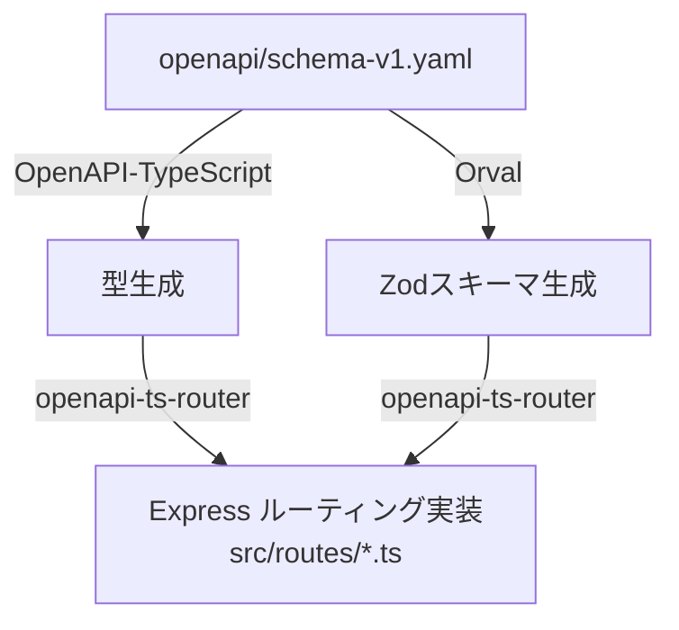

# OpenAPI TypeScript Express Example

## 概要

このプロジェクトは、OpenAPI 仕様から TypeScript Express アプリケーションのコードとスキーマーを自動生成する方法を示すサンプルです。OpenAPI 仕様を起点として型安全な API エンドポイントを実装できます。



- OpenAPI-TypeScript
  - https://openapi-ts.dev/
- Orval
  - https://orval.dev/
- openapi-ts-router
  - https://github.com/builder-group/community/tree/develop/packages/openapi-ts-router

## 必要環境

- Node.js@22.14
- pnpm@10.8

## 依存関係のインストール

```
pnpm install
```

## OpenAPI 型とスキーマの生成

```
pnpm generate:openapi
```

## 開発サーバーの起動

```
pnpm dev
```

## プロジェクトのビルド

```
pnpm build
```

## 本番起動

```
node dist/main.mjs
```
